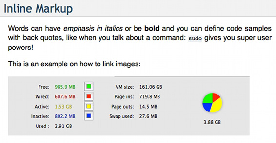

.. Lines starting with two dots are special commands. But if no command can be found, the line is considered as a comment

=================
Restructured Text
=================

Note that there must be as many equals signs as title characters.

Formatting Text
===============

Font
----

You can  put text in *italic* or in **bold**, you can "mark" text as code with double backquote ``print()``.

Inline Markup
-------------
Words can have *emphasis in italics* or be **bold** and you can
define code samples with back quotes, like when you talk about a
command: ``sudo`` gives you super user powers!

Showing code examples
---------------------

>>> 1 + 1
2
>>>

.. code-block:: ruby

   Some Ruby code.

Admonition
----------
.. admonition:: Changing the configuration file

   Extensions local to a project should be put within the project’s directory structure.
   Set Python’s module search path, sys.path, accordingly so that Sphinx can find them.
   E.g., if your extension foo.py lies in the exts subdirectory of the project root,
   put into conf.py::

      import sys, os
      sys.path.append(os.path.abspath('exts'))
      extensions = ['foo']

   You can also install extensions anywhere else on sys.path, e.g. in the site-packages directory.

Links
-------------

- By adding an underscore after a word : Github_ and by adding the target URL after the text (this way has the advantage to not insert unnecessary URLs inside readable text).
- By typing a full comprehensible URL : https://github.com/ (will be automatically converted to a link)
- By making a more Markdown-like link: `Github <https://github.com/>`_ .

Listing Items
=============

Unnumbered List
---------------
Lists can be unnumbered like:

 * Item Foo
 * Item Bar

or

- First item
- Second item
    - Sub item

or

* First item
* Second item
    * Sub item

Numbered List
-------------

Or automatically numbered:

 #. Item 1
 #. Item 2

Table View:
-----------
Tables are really easy to write:

=========== ========
Country     Capital
=========== ========
France      Paris
Japan       Tokyo
=========== ========

Going Graphic
=============

Image
-----

This is an example on how to link images:

Graphviz
--------

.. include:: graviz-diagram.rst

PlantUml
--------

Example 1:

.. uml::

   Alice -> Bob: Hi!
   Alice <- Bob: How are you?

Example 2:

.. uml::

   actor Foo1
   boundary Foo2
   control Foo3
   entity Foo4
   database Foo5
   collections Foo6
   Foo1 -> Foo2 : To boundary
   Foo1 -> Foo3 : To control
   Foo1 -> Foo4 : To entity
   Foo1 -> Foo5 : To database
   Foo1 -> Foo6 : To collections

Reading
=======
- `Official quick reference <http://docutils.sourceforge.net/docs/user/rst/quickref.html>`_ .